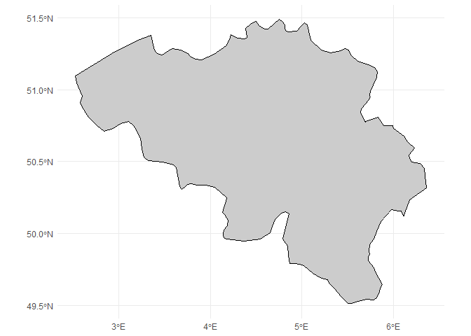
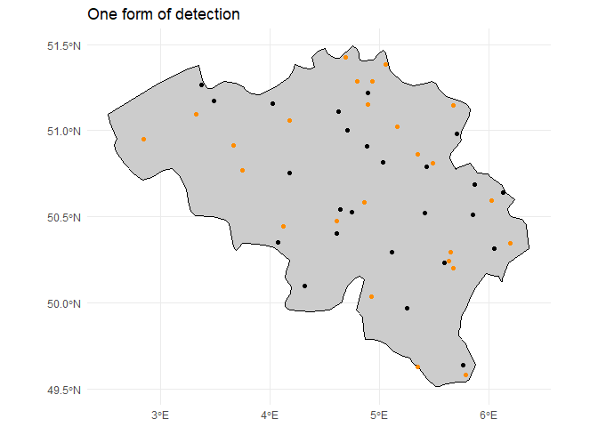

<!-- README.md is generated from README.Rmd. Please edit that file -->

# gcube <a href="https://b-cubed-eu.github.io/gcube/"></a>

<!-- badges: start -->

[](https://CRAN.R-project.org/package=gcube)
[](https://github.com/b-cubed-eu/gcube/actions/workflows/R-CMD-check.yaml)
[](https://app.codecov.io/gh/b-cubed-eu/gcube/)
[](https://www.repostatus.org/#concept)

<!-- badges: end -->

The goal of **gcube** is to provide a simulation framework for
biodiversity data cubes using the R programming language. This can start
from simulating multiple species distributed in a landscape over a
temporal scope. In a second phase, the simulation of a variety of
observation processes and effort can generate actual occurrence
datasets. Based on their (simulated) spatial uncertainty, occurrences
can then be designated to a grid to form a data cube.

Simulation studies offer numerous benefits due to their ability to mimic
real-world scenarios in controlled and customizable environments.
Ecosystems and biodiversity data are very complex and involve a
multitude of interacting factors. Simulations allow researchers to model
and understand the complexity of ecological systems by varying
parameters such as spatial and/or temporal clustering, species
prevalence, etc.

## Installation

You can install the development version from
[GitHub](https://github.com/) with:

``` r
# install.packages("remotes")
remotes::install_github("b-cubed-eu/gcube")
```

## Example

This is a basic example which shows you how to solve a common problem:

``` r
library(gcube)
library(tidyverse)
#> ── Attaching core tidyverse packages ──────────────────────── tidyverse 2.0.0 ──
#> ✔ dplyr     1.1.4     ✔ readr     2.1.4
#> ✔ forcats   1.0.0     ✔ stringr   1.5.0
#> ✔ ggplot2   3.5.0     ✔ tibble    3.2.1
#> ✔ lubridate 1.9.3     ✔ tidyr     1.3.0
#> ✔ purrr     1.0.2     
#> ── Conflicts ────────────────────────────────────────── tidyverse_conflicts() ──
#> ✖ dplyr::filter() masks stats::filter()
#> ✖ dplyr::lag()    masks stats::lag()
#> ℹ Use the conflicted package (<http://conflicted.r-lib.org/>) to force all conflicts to become errors
library(rnaturalearthdata)
library(rnaturalearth)
#> Support for Spatial objects (`sp`) will be deprecated in {rnaturalearth} and will be removed in a future release of the package. Please use `sf` objects with {rnaturalearth}. For example: `ne_download(returnclass = 'sf')`
#> 
#> Attaching package: 'rnaturalearth'
#> 
#> The following object is masked from 'package:rnaturalearthdata':
#> 
#>     countries110
library(terra)
#> terra 1.7.71
#> 
#> Attaching package: 'terra'
#> 
#> The following object is masked from 'package:tidyr':
#> 
#>     extract
library(sf)
#> Linking to GEOS 3.11.2, GDAL 3.8.2, PROJ 9.3.1; sf_use_s2() is TRUE

# Get a polygon to add points to
belgium <- ne_countries(scale = "medium", country = "Belgium",
                        returnclass = "sf") %>% 
  dplyr::select(1) 

ggplot() + 
  geom_sf(data = belgium, 
          fill = "grey80",
          col = "black") +
  theme_minimal()
```



## Occurrence process

We generate occurrence points within the polygon of interest, these are
the “real” occurrences of the species, whether we have observed them or
not. In the simulate_occurrences() function the user can specify
different levels of spatial clustering, and can define the trend change
of the species over time.

``` r
belgium <- belgium %>% st_set_crs(value = NA)
occ <- simulate_occurrences(belgium,
                            initial_average_abundance = 50,
                            n_time_points = 1) %>% 
  rename(time_point  = time)
#> [using unconditional Gaussian simulation]

ggplot() + 
  geom_sf(data = belgium, 
          fill = "grey80",
          col = "black") +
  geom_sf(data = occ) +
  theme_minimal()
```


## Detection process

In this step we define the sampling process, based on the detection
probability of the species and the sampling effort.

``` r
obs <- sample_observations(
  occ,
  detection_probability = 0.5,
  sampling_bias = "no_bias"
)
# sampled_occ <- sample_n(occ, 25)

ggplot() + 
  geom_sf(data = belgium, 
          fill = "grey80",
          col = "black") +
  geom_sf(data = occ) +
  geom_sf(data = obs, col = "darkorange") +
  ggtitle("Detected occurrences in orange") +
  theme_minimal()
```



## Grid designation process

Finally, occurrences are designated to a grid to create a occurrence
cube.

``` r
sf_use_s2(FALSE)
#> Spherical geometry (s2) switched off
# Add buffer uncertainty in meters around points, randomly sampled from gamma distribution
buffered_obs <- add_coordinate_uncertainty(
  obs,
  coords_uncertainty_meters = 10)

# Define your grid
grid_df <- st_make_grid(
  belgium, # grid as the extent of polygon
  n = c(10,10)) %>% 
  st_intersection(belgium) %>% 
  st_as_sf() %>% 
  rename(geometry = x)
plot(grid_df)  
```


``` r

gridded_obs <- grid_designation(
  observations = obs,
  grid = grid_df)
#> Warning: No column `coordinateUncertaintyInMeters` present! Assuming no uncertainty
#> around observations.

ggplot() + 
  geom_sf(data = belgium,
          fill = "grey80",
          col = "black") +
  geom_sf(data = gridded_obs, aes(fill = n)) +
  scale_fill_continuous("Number of\nobservations", type = "viridis") +
  theme_minimal()
```


